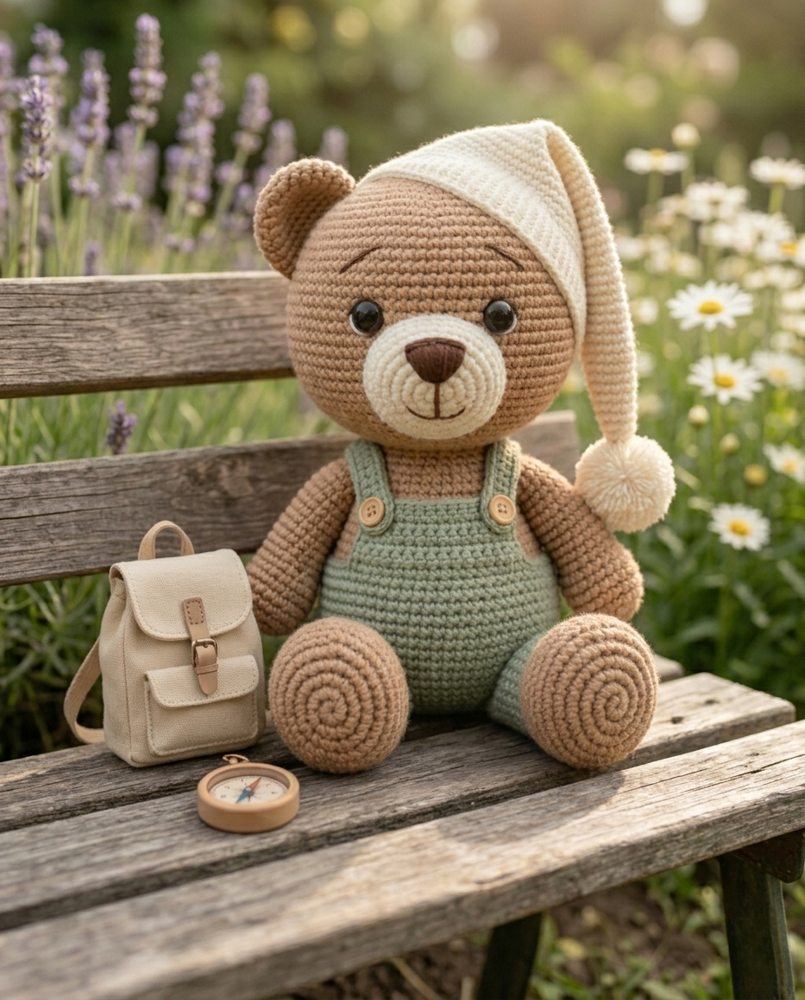
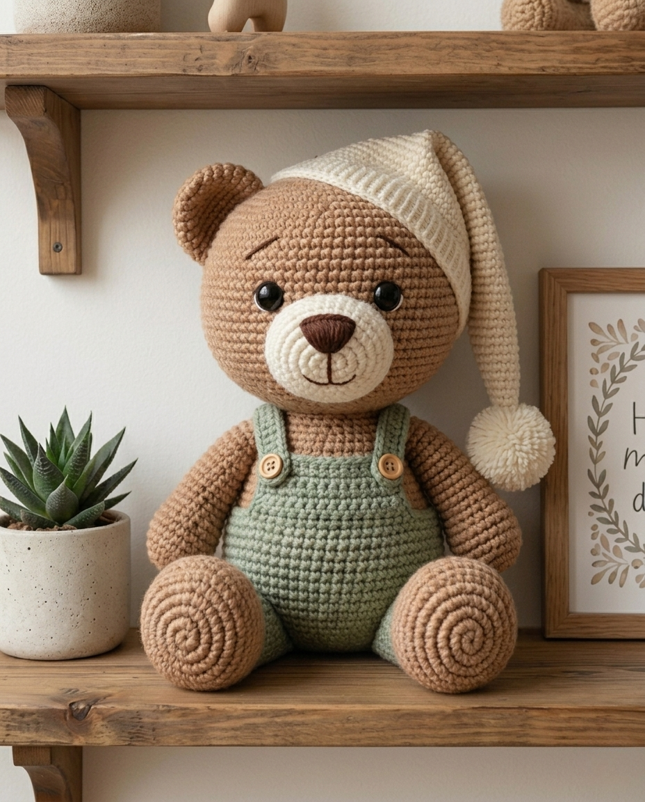
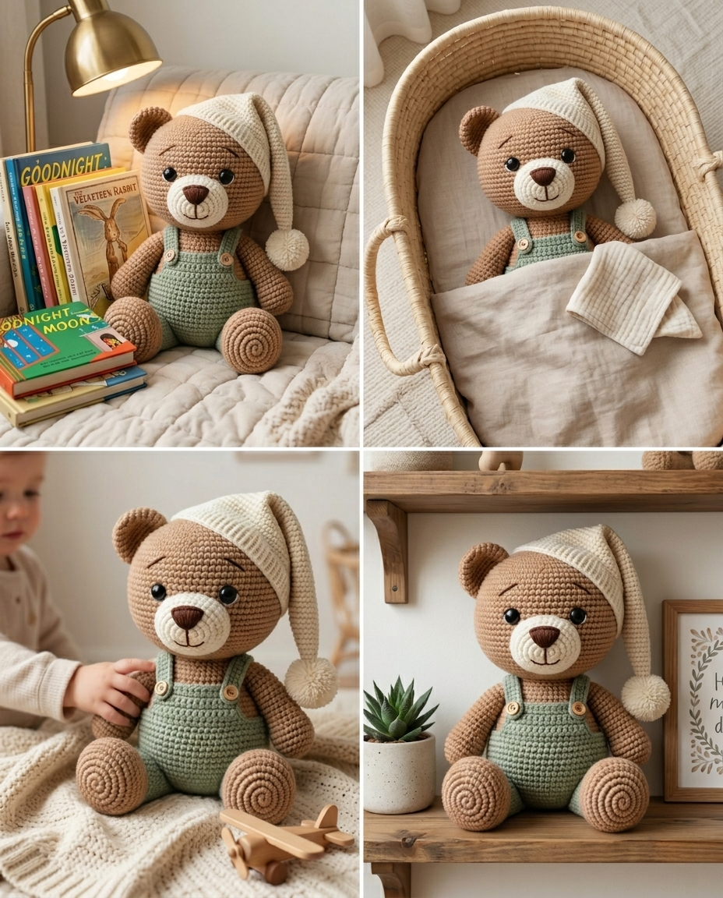
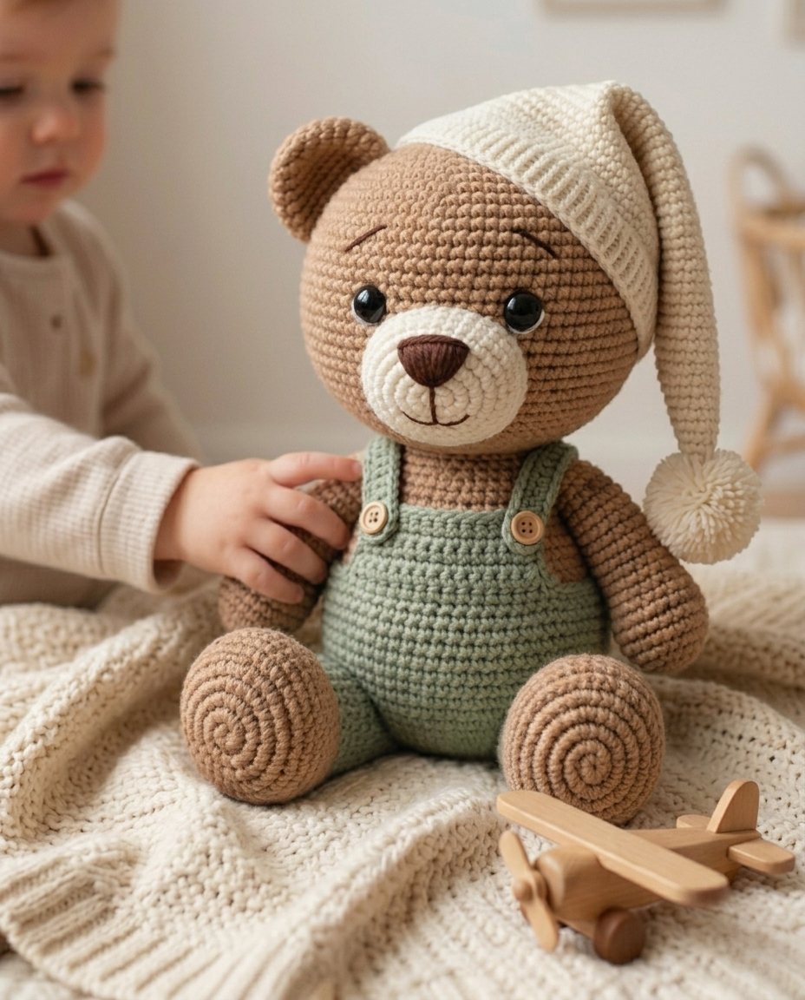

# Crochet Teddy Bear Pattern

## Table of Contents

## Introduction
A crochet teddy bear pattern is one of the most rewarding projects for beginners and experienced crocheters alike. Whether you're creating a heartfelt handmade gift, decorating a nursery, or expanding your amigurumi collection, a teddy bear is a timeless project that never goes out of style.

Unlike many advanced crochet projects, a well-designed teddy bear pattern allows you to practice essential stitches while creating something both practical and memorable. From selecting the right yarn to assembling each piece, every step helps improve your crochet skills.

This guide covers everything you need to know before starting your next crochet teddy bear project. You'll learn about materials, choosing the right pattern, beginner tips, and common mistakes so you can complete your project with confidence.

If you're searching for an easy teddy bear crochet pattern, a classic crochet pattern for teddy bear, or an amigurumi crochet teddy bear pattern, this guide will help you make the right choice.

## Why Crochet Teddy Bears Are So Popular

Crochet teddy bears have remained one of the most loved amigurumi projects for many years. Their timeless appearance and endless customization options make them suitable for almost every occasion.

Some popular reasons include:

Handmade baby shower gifts
Birthday presents
Nursery room decoration
Holiday gifts
Keepsake collections
Craft fair products

Unlike trendy crochet items that may lose popularity over time, teddy bears remain evergreen because they appeal to both children and adults.

Another advantage is that most crochet teddy bear patterns use simple construction techniques. Even beginners can achieve beautiful results by following clear instructions and practicing basic stitches.

## Materials You'll Need

Choosing the right materials makes a significant difference in the final appearance of your teddy bear.

Yarn

Medium-weight cotton or acrylic yarn is recommended for beginners because it provides excellent stitch definition and is easy to work with.

Popular yarn colors include:

Brown
Beige
White
Cream
Grey
Pastel shades
Crochet Hook

Always follow the hook size recommended in your pattern. Most amigurumi teddy bears use a smaller hook than standard crochet projects to create tighter stitches.

Stuffing

High-quality polyester fiberfill keeps your teddy bear soft while maintaining its shape over time.

Safety Eyes

Safety eyes give teddy bears a professional appearance. If the toy is intended for very young children, embroidered eyes are often the safer choice.

Other Supplies
Stitch markers
Yarn needle
Small scissors
Measuring tape
Pins for assembly

Using quality materials from the beginning often results in a cleaner finish and a more durable handmade toy.

## Choosing the Right Crochet Teddy Bear Pattern

Not every crochet teddy bear pattern is designed for the same skill level. Before starting, consider your experience and the amount of time you want to invest.

Beginners should look for patterns that include:

Step-by-step instructions
Clear stitch counts
Helpful photos
Assembly guidance
Material recommendations

Intermediate crocheters may enjoy patterns with clothing, accessories, jointed limbs, or advanced shaping techniques.

Classic teddy bear crochet patterns often focus on traditional proportions, while modern amigurumi teddy bear crochet designs feature oversized heads, expressive faces, and cute miniature details.

If you prefer a printable PDF with detailed instructions and clear photos, you can explore a complete [Crochet Teddy Bear Pattern](https://www.etsy.com/listing/4515663230/crochet-teddy-bear-pattern-pdf-chenille) here:

Choosing a well-written pattern can save hours of frustration and help you enjoy the creative process from start to finish.

## Step-by-Step Crochet Process

Every crochet teddy bear pattern has its own unique construction method, but most follow a similar process. Understanding these basic steps before you begin can make the project much easier, especially if you're creating your first amigurumi teddy bear.

### 1. Crochet the Head

The head is usually the largest part of the teddy bear. Most patterns start with a magic ring and increase gradually until the desired size is reached. Even tension is important because it helps create a smooth, rounded shape.

### 2. Make the Body

The body is typically worked in continuous rounds. Keep your stitch count accurate and use stitch markers to avoid losing your place. Stuff the body gradually instead of waiting until the end, as this creates a firmer and more balanced finish.

### 3. Crochet the Arms and Legs

The arms and legs are usually made separately before being attached to the body. Make sure both sides are identical by counting every round carefully. Small differences become noticeable once the teddy bear is assembled.

### 4. Create the Ears

Tiny ears may seem simple, but they add personality to your finished teddy bear. Position them carefully before sewing them in place. Symmetry makes a big difference in the final appearance.

### 5. Attach All Pieces

Use sewing pins to temporarily position the head, arms, legs, and ears before stitching everything together. This allows you to make adjustments before permanently attaching each piece.

### 6. Add Facial Details

Safety eyes, embroidered eyebrows, and a neatly stitched nose bring your crochet teddy bear to life. Take your time during this stage because facial details create the character and expression of the finished project.

### 7. Final Inspection

Before calling your project complete, check for loose ends, uneven stuffing, or visible gaps. A few extra minutes of finishing work can dramatically improve the overall quality.

---

## Beginner Tips for Better Results

If you're new to crochet, don't worry. A simple crochet teddy bear pattern is an excellent project for building confidence and learning new techniques.

Here are a few tips that experienced crocheters recommend:

* Read the entire pattern before picking up your hook.
* Practice making a neat magic ring if you're unfamiliar with it.
* Use stitch markers to keep track of each round.
* Count your stitches regularly instead of guessing.
* Stuff each section gradually for a smoother shape.
* Don't rush the sewing process. Good assembly makes a huge difference.

Many beginners think speed is the goal, but consistency is much more important. Taking your time often produces cleaner stitches and a more professional-looking teddy bear.

---

## Common Mistakes to Avoid

Even experienced crocheters occasionally make mistakes. Fortunately, most of them are easy to prevent.

### Using the Wrong Hook Size

A hook that's too large creates visible holes, allowing stuffing to show through. Always use the hook size recommended in your crochet pattern for teddy bear projects.

### Inconsistent Tension

Loose stitches in one section and tight stitches in another can distort the overall shape. Try to maintain the same tension throughout the project.

### Overstuffing

Adding too much stuffing can stretch the stitches and change the teddy bear's proportions. Fill each section until it feels firm but not overly tight.

### Skipping Stitch Counts

One missed increase or decrease may affect the entire project. Counting stitches after every round helps prevent major problems later.

### Rushing Assembly

Many crocheters spend hours making individual pieces but rush the final sewing process. Proper alignment creates a cleaner and more symmetrical finished teddy bear.

---

## Free vs Premium Crochet Patterns

There are thousands of free crochet teddy bear patterns available online, making them a great option for practicing basic techniques. However, free patterns often vary in quality, and some may include limited photos or minimal instructions.

Premium PDF patterns usually offer:

* Detailed step-by-step instructions
* High-quality progress photos
* Clear stitch counts
* Printer-friendly formatting
* Helpful assembly tips
* Better support from the designer

Whether you choose a free or premium pattern depends on your experience level and the type of project you want to complete. Beginners often appreciate the extra guidance included in professionally designed PDF patterns.

## Frequently Asked Questions

### Is a crochet teddy bear pattern suitable for beginners?

Yes. Many beginner-friendly patterns are designed with basic stitches such as single crochet, increases, and decreases. If you can crochet in continuous rounds and follow simple stitch counts, you can successfully complete your first teddy bear.

### What is the best yarn for a crochet teddy bear?

Cotton and acrylic yarn are both excellent choices. Cotton provides better stitch definition, while acrylic is soft, lightweight, and widely available. Choose a yarn that matches the recommended hook size in your pattern.

### How long does it take to crochet a teddy bear?

The time depends on the pattern and your experience. A simple crochet teddy bear can often be completed over a weekend, while larger or more detailed designs may take several days.

### Can I sell teddy bears made from a crochet pattern?

Many independent designers allow the sale of finished handmade items in small quantities, but the pattern itself remains protected by copyright. Always read the designer's terms before selling finished products.

### What's the difference between a free and premium crochet pattern?

Free patterns are a great way to practice, but premium PDF patterns often include detailed instructions, step-by-step photos, printable formatting, and additional tips that make the project easier to complete.

---

## Final Thoughts

Crocheting a teddy bear is more than just another crochet project—it's an opportunity to create something meaningful that can be treasured for years. Whether you're making a thoughtful handmade gift, decorating a nursery, or expanding your amigurumi collection, choosing a clear and well-written pattern makes the entire process more enjoyable.

Take your time, practice consistently, and don't worry if your first teddy bear isn't perfect. Every project improves your crochet skills and helps you gain confidence for more advanced designs.

If you're looking for a printable PDF with detailed instructions, helpful photos, and an easy-to-follow layout, you can explore this **[Crochet Teddy Bear Pattern](PASTE_YOUR_ETSY_LISTING_URL_HERE)**.

Happy crocheting, and enjoy creating your own handmade teddy bear!

---

## Copyright

This article is provided for educational purposes. Please respect the copyright of all crochet pattern designers and avoid sharing or redistributing paid patterns without permission.
